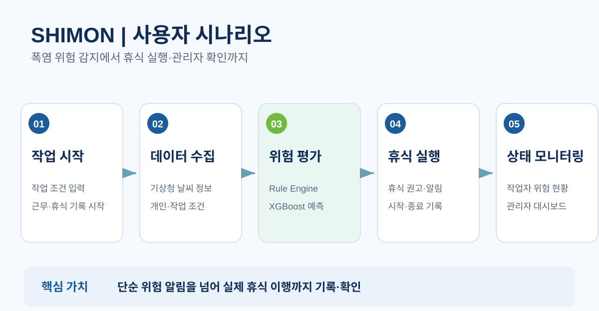
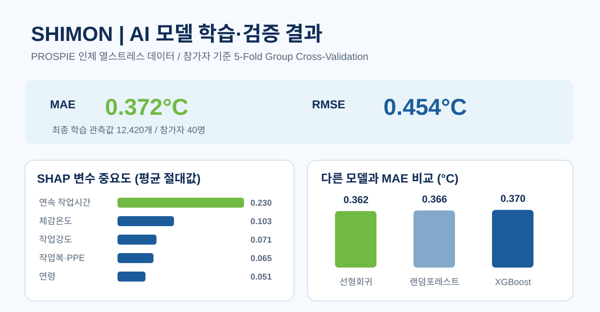

# SHIMON | 폭염 환경 옥외노동자 온열 위험 예측 및 휴식 관리 서비스

> 기상 환경과 개인별 작업 조건을 함께 분석해 온열 위험을 사전에 파악하고, 휴식 권고가 실제 휴식 기록으로 이어지도록 설계한 AI 안전관리 서비스 MVP

## 1. 프로젝트 소개

폭염이 심한 옥외 작업 현장에서는 같은 장소에 있는 작업자라도 연령, 작업강도, 보호구 착용 여부, 연속 작업시간에 따라 온열 부담이 달라질 수 있습니다. 또한 안전관리자는 여러 작업자의 상태를 동시에 확인하고, 휴식이 필요한 작업자가 실제로 휴식을 취했는지 추적하기 어렵습니다.

**SHIMON**은 이러한 문제를 해결하기 위해 기상청 날씨 정보와 작업자별 조건을 활용한 **XGBoost 기반 심부체온 추정**, **규칙 기반 휴식 판단**, **작업·휴식 이력 관리**를 하나의 흐름으로 연결한 프로젝트입니다.

단순히 위험 알림을 보여주는 데서 끝나지 않고, **작업 시작 → 위험 평가 → 휴식 권고 → 휴식 실행 → 관리자 확인**까지 이어지는 MVP를 구현했습니다.

| 항목 | 내용 |
| --- | --- |
| 개발 기간 | 2026년 8월 (EST AI Challengers 해커톤) |
| 프로젝트 | EST AI Challengers 해커톤 팀 프로젝트 |
| 팀 구성 | 경건웅(팀장), 김영은, 우동균, 이하림, 송찬영 — 총 5명 |
| 핵심 기술 | Python, FastAPI, PostgreSQL, SQLAlchemy, Alembic, XGBoost, React, Vite |
| 개발 범위 | 작업자·관리자 화면, 인증, 작업·휴식 기록, 날씨 연동, 위험 평가, 알림 및 대시보드 MVP |

## 2. 핵심 기능

### 작업자용 기능
- 작업 시작·종료, 휴식 시작·종료 및 작업·휴식 이력 조회
- 기상청 데이터를 활용한 현장 기상 상황 및 체감온도 표시
- 개인의 작업 조건을 반영한 심부체온 예측 및 위험 수준 안내
- 규칙 기반 휴식 필요 상태와 AI 기반 온열 위험을 구분해 표시
- 휴식 권고 및 관련 알림 확인

### 관리자용 기능
- 현장별 작업자 상태와 위험 수준을 대시보드에서 확인
- 작업자별 연속 작업시간, 휴식 상태 및 위험도 확인
- 위험 등급 상승에 따른 알림 확인 및 특정 작업자에게 휴식 권고 전달
- 권고 이후 작업자의 실제 휴식 시작·종료 상태 확인

## 3. 시스템 구성 및 처리 흐름

~~~text
기상청 API + 작업자 프로필 + 작업/휴식 이력
                    │
                    ▼
          FastAPI / PostgreSQL
                    │
          ┌─────────┴─────────┐
          ▼                   ▼
  XGBoost 심부체온 추정   규칙 기반 휴식 판단
          │                   │
          └─────────┬─────────┘
                    ▼
         위험 수준 및 휴식 권고
                    │
          ┌─────────┴─────────┐
          ▼                   ▼
     작업자 화면         관리자 대시보드
          │
          ▼
       휴식 실행 및 기록
~~~

**주요 설계 사항**

1. **AI 예측과 휴식 규칙의 역할 분리:** AI는 개인별 온열 위험을 추정하고, 규칙 엔진은 체감온도 및 작업시간 등의 기준을 바탕으로 휴식 필요 상태를 판단합니다. AI 결과가 규칙 기반 휴식 조치를 취소하지 않도록 분리했습니다.
2. **실시간 조회와 이력 저장 분리:** 작업자·관리자 조회 요청에는 최신 위험 계산 결과를 제공하고, 위험 평가 이력은 5분 주기 백그라운드 작업에서 저장하도록 구성했습니다.
3. **알림 중복 최소화:** 위험도 점검 시 등급이 상승한 경우에 알림 기록을 생성하도록 처리했습니다.
4. **휴식 이행 추적:** WorkSession과 RestRecord를 구분해 작업자 상태를 기록하고 관리자 화면에서 확인할 수 있도록 연결했습니다.

## 4. AI 모델 및 검증

*최종발표 PPT 13–14쪽의 검증 수치·SHAP 도표·모델 비교를 바탕으로 재구성했습니다. 서로 다른 비교 실험의 수치를 혼동하지 않도록 원자료를 함께 확인해 주세요.*

공개된 **PROSPIE 인체 열스트레스 데이터셋**을 활용해 XGBoost 회귀 모델로 심부체온을 추정했습니다.

- **데이터:** 참가자 40명, 전처리 후 학습 관측값 12,420개
- **입력 변수:** 체감온도, 연령, 작업강도, 보호구·작업복 조건, 연속 작업시간
- **예측 대상:** 심부체온(Core Body Temperature)
- **검증 방식:** 참가자 단위 5-Fold GroupKFold 교차검증 — 동일 참가자의 반복 관측값이 학습·검증 세트에 동시에 포함되는 데이터 누수 방지
- **검증 결과:** 평균 MAE **0.3717°C**, 평균 RMSE **0.4538°C**

위 수치는 **팀 프로젝트의 모델 검증 결과**이며, 실제 산업 현장에서 온열질환을 진단하거나 예방 효과를 입증한 수치는 아닙니다.

자세한 데이터 구성·전처리·모델 한계: [AI 모델 문서](ai/heat_risk_model_documentation.md)

## 5. 팀원별 담당 역할 및 기여

이 프로젝트는 **EST AI Challengers 11팀의 공동 작업물**입니다. 아래 내용은 팀 노션의 기획서·개발 계약 문서에 기록된 역할 분담을 바탕으로 정리했습니다. 기능 및 설계 문서에는 개발 계획도 포함되어 있으므로, 단순한 역할 명시만으로 모든 기능의 개인별 최종 구현을 확정하지는 않습니다.

| 팀원 | 담당 영역 | 주요 역할 및 산출물 |
| --- | --- | --- |
| **경건웅 (팀장)** | 프로젝트 총괄·백엔드/서비스 연동 | 요구사항 및 개발 우선순위 조율, 기상 데이터/휴식 규칙 인터페이스, AI 예측과 API·화면 연결 및 데모 통합 지원 |
| **김영은** | 프런트엔드 | 작업자용 모바일 웹과 관리자 대시보드 화면 구현, 작업·휴식 및 상태 조회 API와 UI 연결 |
| **우동균** | AI 모델링·데이터 처리 | 온열 스트레스 데이터 전처리, 모델 입력 특성 정의, XGBoost 심부체온 예측 모델 학습·검증 및 SHAP 분석 |
| **이하림** | 디자인·발표 자료 | 서비스 UI/UX 방향 검토, 프로젝트 발표자료 및 서비스 소개·시연 시각자료 제작 |
| **송찬영** | 백엔드·기획/발표 | 인증, PostgreSQL 데이터 및 작업·휴식 API, 통합 응답·평가 흐름 설계/구현, 기획 및 발표 준비 |

**팀 협업의 핵심:** 기상정보·휴식 규칙, AI 예측, 작업/휴식 기록, 작업자·관리자 화면 사이의 API 데이터 형식을 조율해 하나의 시연 흐름으로 연결했습니다.

**역할 근거:** [EST 11팀 노션](https://app.notion.com/p/EST-11-3b8f460d48d3801ba12afeb3337a20cb?source=copy_link)의 기획서와 「0818 해커톤 API · DB 설계 v1 — 개발 Contract」. 팀원별 Git 커밋만으로 기여도를 판단하지 않았으며, 필요 시 당사자 확인을 거쳐 조정할 수 있습니다.

## 6. 결과 및 한계

**구현 결과**
- 작업자 상태 조회, 위험 평가, 휴식 기록 및 관리자 확인이 이어지는 데모 시나리오 구현
- 규칙 엔진과 AI 모델의 결과를 분리하면서 하나의 서비스 흐름으로 연결
- 실제 관측 데이터 기반 모델을 API에 연동하고 작업·휴식 기록과 함께 조회하도록 구성

**한계 및 개선 과제**
- AI 모델은 실험실에서 수집된 참가자 40명의 데이터를 학습했으므로 실제 건설 현장과 다양한 연령대에 그대로 일반화하기 어렵습니다.
- 학습 데이터의 연속 작업시간 범위가 최대 61분이므로 장시간 작업 구간의 모델 예측에 한계가 있습니다.
- 본 서비스는 해커톤 MVP로, 의료 진단이나 공인된 현장 안전 판정을 대체하지 않습니다.

## 7. 이미지 및 발표 자료

- **서비스 흐름:** [서비스 시나리오 다이어그램](assets/images/shimon-service-flow.svg) — 최종발표 PPT 7–8쪽 기반
- **시스템 아키텍처:** [구성요소 및 데이터 흐름](assets/images/shimon-architecture.svg) — 최종발표 PPT 8쪽 및 저장소 코드 기반
- **AI 검증:** [성능 수치·SHAP·모델 비교](assets/images/shimon-ai-evaluation.svg) — 최종발표 PPT 13–14쪽 기반

이 이미지들은 **원본 슬라이드를 그대로 캡처한 파일이 아니라 발표자료를 근거로 README 가독성에 맞게 새로 그린 도식**입니다. 발표 원본 및 기획 기록은 위 팀 노션에서 확인할 수 있습니다.

## 8. 저장소 구조

| 경로 | 내용 |
| --- | --- |
| [backend/](backend/) | FastAPI API, 인증, 작업·휴식 도메인, 위험 평가 및 스케줄러 |
| [ai/](ai/) | 학습·전처리·추론 스크립트, XGBoost 모델 및 검증 문서 |
| [frontend/](frontend/) | 작업자·관리자 웹 화면 |
| [database/](database/) | 데이터베이스 스키마 및 시드 자료 |
| [docs/](docs/) | API 명세, 아키텍처 및 구현 과정 기록 |

> **참고:** 온열 위험도와 휴식 규칙은 안전 의사결정을 보조하기 위한 데모 로직입니다. 실제 현장 적용 전에는 공인 기준 검토, 추가 데이터 확보 및 현장 검증이 필요합니다.
