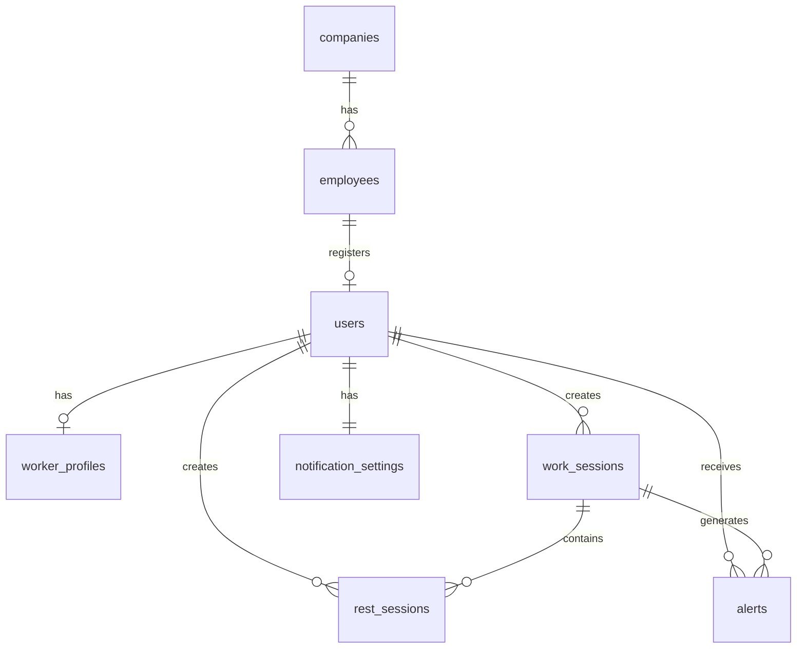

# SHIMON Database

SHIMON 팀이 GitHub에서 DB 구조를 같이 관리하기 위한 폴더입니다.

## 폴더 구조

```text
database/
├── README.md
├── schema.sql
└── seed.sql
```

- `schema.sql`: 실제 DB 테이블 구조
- `seed.sql`: 개발용 회사 / 사원 샘플 데이터
- `README.md`: DB 구조와 팀 개발 규칙

---

## 현재 회원가입 흐름

```text
사원코드 + 이름 입력
        ↓
employees 테이블에서 사원 확인
        ↓
회사 / 권한(worker, admin) 확인
        ↓
회원가입 정보 입력
        ↓
users 생성
        ↓
worker인 경우 worker_profiles 생성
```

`employees`와 `users`는 역할이 다릅니다.

### employees

회사에서 미리 등록해 둔 **사원 명부**입니다.

예:

```text
HB-W001 / 김철수 / 한빛건설 / worker
HB-W002 / 김민준 / 한빛건설 / worker
HB-A001 / 관리자 / 한빛건설 / admin
```

회원가입 전에 이 데이터로 실제 사원인지 확인합니다.

### users

사원 인증 후 **실제로 SHIMON 회원가입을 완료한 계정**입니다.

---

## ERD



---

## 주요 테이블

### companies

회사 정보.

| 컬럼 | 설명 |
|---|---|
| id | 회사 PK |
| name | 회사명 |
| created_at | 생성일 |
| updated_at | 수정일 |

### employees

회사 사원 명부.

| 컬럼 | 설명 |
|---|---|
| id | 사원 PK |
| company_id | 소속 회사 |
| employee_code | 사원코드 |
| name | 이름 |
| role | worker / admin |
| job_type | 작업 유형 |
| workplace | 작업 장소 |
| is_active | 재직/사용 가능 여부 |

### users

실제 회원 계정.

| 컬럼 | 설명 |
|---|---|
| id | 사용자 PK |
| employee_id | 연결된 사원 |
| email | 이메일 |
| phone | 전화번호 |
| password_hash | 해시된 비밀번호 |
| gender | 성별 |
| account_status | 계정 상태 |

### worker_profiles

노동자 전용 정보.

| 컬럼 | 설명 |
|---|---|
| user_id | users FK |
| age | 연령 |
| work_intensity | 낮음 / 보통 / 높음 |
| uniform | 작업복 착용 여부 |
| health_condition | 건강 관련 정보 |

### work_sessions

작업 시작/종료 기록.

### rest_sessions

휴식 시작/종료 기록.

### alerts

폭염 위험, 휴식 권장 등의 알림 기록.

### notification_settings

사용자별 알림 ON/OFF 설정.

---

## 역할 구분

노동자와 관리자를 별도의 회원 테이블로 분리하지 않습니다.

```text
employees.role

worker
admin
```

로그인 성공 후 `role` 값으로 화면과 API 권한을 구분합니다.

```text
worker → 노동자 모바일 화면
admin  → 관리자 대시보드
```

---

## 실행 순서

PostgreSQL 기준:

```bash
psql -d shimon -f database/schema.sql
psql -d shimon -f database/seed.sql
```

Supabase SQL Editor를 사용한다면:

1. `schema.sql` 전체 실행
2. `seed.sql` 전체 실행

순서로 적용하면 됩니다.

---

## 팀 개발 규칙

### 1. schema.sql 직접 덮어쓰지 않기

DB 변경이 생기면 팀원과 먼저 공유하고 PR로 반영합니다.

추천:

```text
feature/db-user-schema
feature/db-work-session
fix/db-alert-index
```

### 2. 비밀번호를 GitHub에 올리지 않기

다음 정보는 절대 커밋하지 않습니다.

```text
DB_PASSWORD
SUPABASE_SERVICE_ROLE_KEY
JWT_SECRET
실제 사용자 비밀번호
```

### 3. `.env`는 커밋하지 않기

GitHub에는 `.env.example`만 올립니다.

### 4. seed.sql에는 실제 개인정보를 넣지 않기

현재 데이터는 개발용 샘플 데이터입니다.

실제 노동자의 전화번호, 이메일, 건강정보 등을 `seed.sql`에 넣지 않습니다.

### 5. 건강정보 접근 제한

`health_condition`은 민감정보이므로 관리자 화면과 API에서 꼭 필요한 범위만 사용합니다.

---

## 다음 작업

현재 프론트엔드의 아래 기능을 DB/API와 연결해야 합니다.

```text
회원가입
로그인
사원코드 인증
작업 시작 / 종료
휴식 시작 / 종료
위험 알림
관리자 작업자 목록
```

프론트에서 직접 DB 비밀번호를 사용하는 방식은 금지합니다.

권장 구조:

```text
Frontend
   ↓
Backend API / Supabase
   ↓
PostgreSQL
```
