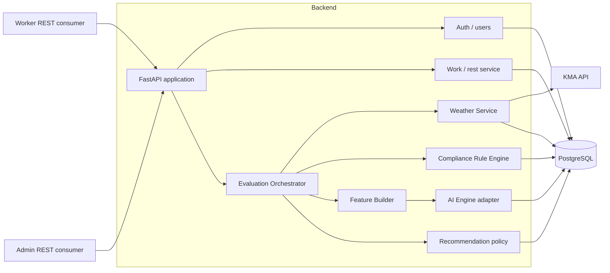
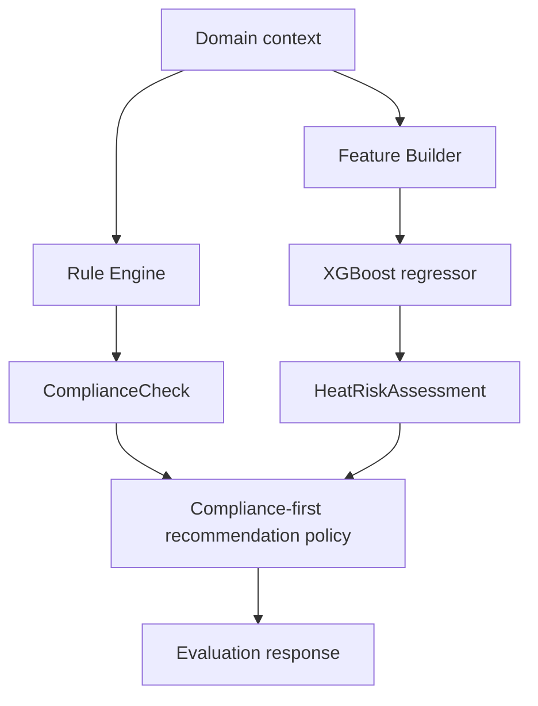
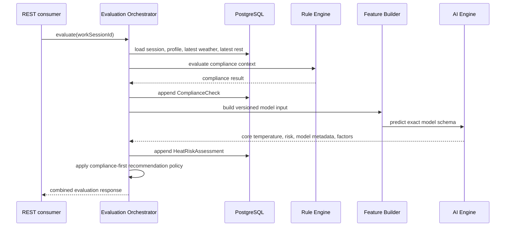

# SHIMON Architecture

## Architecture decision

P0 uses one modular FastAPI backend backed by PostgreSQL. Rule evaluation, AI inference integration, weather integration, work/rest workflows, and REST APIs remain clear modules inside that application. The architecture must support replacing the AI implementation without changing public API consumers.



No P0 component requires a separate microservice. The AI interface may be implemented behind an internal adapter or internal HTTP boundary later, but the public backend owns orchestration and persistence.

## Component responsibilities

| Component | Owns | Must not own |
|---|---|---|
| REST API | Authentication, authorization, validation, stable response envelopes | Compliance thresholds or trained-model logic |
| Work / Rest service | Session lifecycle, state-transition validation, rest-type assignment | Duplicate worker status storage |
| Weather Service | KMA fetch, DEMO fallback, heat-condition calculation, weather log persistence | Claims of authoritative legal measurement |
| Rule Engine | Deterministic compliance status, deadline, required rest duration, rule code/version | AI risk or medical claims |
| Feature Builder | Maps available domain data to the exact versioned model schema | Invented or unsupported model features |
| AI Engine | XGBoost regression inference, risk mapping, model identity, SHAP factors | Legal/compliance decisions |
| Evaluation Orchestrator | Loads inputs, invokes Rule and AI independently, persists both, applies recommendation priority | Hiding one result inside the other |
| Recommendation policy | Resolves presentation/action priority with compliance first | Lowering a legal priority based on AI |
| Database | Source records and auditable evaluation history | A redundant worker-status source of truth |
| Worker/Admin consumers | Display state and invoke explicit commands | Compliance rules or AI business logic |

## Weather strategy

P0 normal path:

```text
GPS or site coordinates
  -> KMA weather API
  -> temperature / humidity / wind
  -> calculated feelsLikeTemperature
  -> site_weather_logs
```

- `KMA_API` is the normal source.
- `DEMO` provides a deterministic fallback for the hackathon demonstration.
- `MANUAL` is reserved in the data model for future manually measured input; no P0 UI is required.
- Persist source and measurement time with every weather log.
- Documentation and product copy must call the calculated value an operational heat-condition input, not an authoritative legal measurement.
- Secrets remain server-side environment variables.

**TODO / NOT FROZEN:** exact formula/version metadata for `feelsLikeTemperature` must be selected before Weather Service implementation.

## Rule Engine and AI Engine boundary



The Rule Engine answers whether rest is required under configured compliance rules. The AI Engine estimates core body temperature and produces `LOW`, `CAUTION`, or `HIGH`. A low AI result cannot cancel `DEADLINE_IMMINENT` or `IMMEDIATE_REST_REQUIRED`.

Canonical admin priority:

1. `IMMEDIATE_REST_REQUIRED`
2. `DEADLINE_IMMINENT`
3. AI `HIGH`
4. AI `CAUTION`
5. `NORMAL`

## Evaluation flow



If AI inference fails, the persisted Rule result must remain valid and must never be weakened. The exact P0 error/fallback presentation is **TODO / NOT FROZEN**.

## Evaluation cadence

Evaluation occurs only:

1. immediately after a WorkSession starts;
2. immediately after a RestRecord ends; or
3. when `POST /api/v1/work-sessions/{id}/evaluate` is called.

P0 has no backend scheduler. Worker/Admin GET endpoints read the latest stored evaluation and do not create a new one implicitly. Frontends may explicitly call the evaluation endpoint when needed.

## Worker state derivation

```text
no active WorkSession                         -> IDLE
active WorkSession + no active RestRecord     -> WORKING
active WorkSession + active RestRecord        -> RESTING
```

Do not add a `worker_status` table or mutable duplicate state field without a documented consistency requirement.

## Persistence and transactions

- `ComplianceCheck` and `HeatRiskAssessment` are separate append-only records.
- Store input snapshots and Rule/model versions so past evaluations can be explained.
- Starting/ending work or rest must validate current state and be safe against accidental duplicate requests.
- A failed evaluation must not silently corrupt WorkSession or RestRecord state.
- Composite GET APIs may aggregate the latest stored checks; they do not rewrite evaluation history.

## P0 infrastructure boundary

Use Python, FastAPI, Pydantic, SQLAlchemy, PostgreSQL, XGBoost, and SHAP. Do not introduce Celery, cron, Kafka, Kubernetes, Redis, event buses, or framework-specific frontend coupling for P0.
