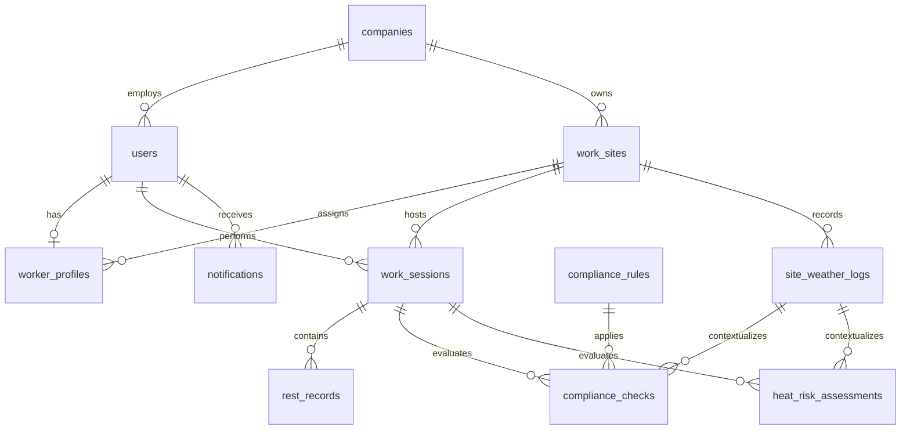

# SHIMON Intended PostgreSQL Schema

## Status and conventions

This document is the canonical target for the P0 domain model. It documents intent; it does not itself create migrations.

- Table and column names use `snake_case`.
- Timestamps use timezone-aware PostgreSQL timestamps and are stored consistently.
- JSON snapshots use `jsonb`.
- Examples assume UUID primary keys to align with the repository's existing SQL draft. A different ID type requires one consistent, explicit contract update.
- Worker state is derived from WorkSession and RestRecord; there is no `worker_status` table.
- `notifications` is P1.

> **Reconciliation required:** the existing `database/schema.sql` predates this frozen contract. It currently uses concepts such as `employees`, `rest_sessions`, and `alerts`, and does not yet contain the required weather, compliance, or AI assessment entities. Do not treat it as already conforming to this document. Update it only in a later implementation task.

## Relationship overview



## Canonical enums

| Domain | Values |
|---|---|
| `users.role` | `WORKER`, `ADMIN` |
| `site_weather_logs.source` | `KMA_API`, `MANUAL`, `DEMO` |
| `work_sessions.status` | `IN_PROGRESS`, `COMPLETED` |
| `rest_records.rest_type` | `LEGAL_REQUIRED`, `AI_RECOMMENDED`, `SELF_INITIATED` |
| `compliance_checks.status` | `NORMAL`, `REST_SCHEDULED`, `DEADLINE_IMMINENT`, `IMMEDIATE_REST_REQUIRED` |
| `heat_risk_assessments.risk_level` | `LOW`, `CAUTION`, `HIGH` |

Implement enums consistently with PostgreSQL enum types or checked strings. The choice is **TODO / NOT FROZEN**; API values remain fixed.

## `companies`

Purpose: tenant/company boundary for users and work sites.

| Field | Notes |
|---|---|
| `id` | PK |
| `code` | Required public/company enrollment code |
| `name` | Required company name |
| `created_at`, `updated_at` | Audit timestamps |

Constraints and indexes:

- PK: `id`
- UNIQUE: `code`
- Optional UNIQUE on normalized `name` only if product rules require unique company names; **TODO / NOT FROZEN**.

## `users`

Purpose: authenticated Worker or Admin account.

| Field | Notes |
|---|---|
| `id` | PK |
| `company_id` | FK -> `companies.id`, required |
| `employee_code` | Required company-local employee identifier |
| `email` | Required login/contact identifier |
| `password_hash` | Required password hash; never plaintext |
| `name`, `phone` | Basic account fields |
| `role` | `WORKER` or `ADMIN` |
| `is_active` | Account availability |
| `last_login_at` | Nullable |
| `created_at`, `updated_at` | Audit timestamps |

Constraints and indexes:

- PK: `id`
- FK: `company_id` -> `companies.id`
- UNIQUE: `(company_id, employee_code)`
- UNIQUE: normalized `email`
- INDEX: `(company_id, role, is_active)` for admin lists
- Never allow the client to persist a plaintext password.

## `worker_profiles`

Purpose: worker-specific profile and site assignment; absent for Admin users.

| Field | Notes |
|---|---|
| `user_id` | PK and FK -> `users.id` |
| `assigned_site_id` | FK -> `work_sites.id`, nullable until assigned |
| `age` | Nullable constrained integer |
| `has_cooling_device` | Service/compliance context if retained by final Rule contract |
| `created_at`, `updated_at` | Audit timestamps |

Constraints and indexes:

- PK/FK: `user_id` -> `users.id`
- FK: `assigned_site_id` -> `work_sites.id`
- CHECK: supported age range when non-null
- INDEX: `assigned_site_id`
- Application validation ensures the referenced user has role `WORKER`.
- **TODO / NOT FROZEN:** final profile fields after privacy and AI feature-schema review.

Profile fields are service context only. Their presence does not prove that the trained AI uses them.

## `work_sites`

Purpose: construction site and weather lookup location.

| Field | Notes |
|---|---|
| `id` | PK |
| `company_id` | FK -> `companies.id` |
| `name` | Required site name |
| `latitude`, `longitude` | Site coordinates |
| `timezone` | IANA timezone, e.g. `Asia/Seoul` |
| `is_active` | Site availability |
| `created_at`, `updated_at` | Audit timestamps |

Constraints and indexes:

- PK: `id`
- FK: `company_id` -> `companies.id`
- UNIQUE: `(company_id, name)`
- CHECK: valid latitude/longitude ranges
- INDEX: `(company_id, is_active)`

## `site_weather_logs`

Purpose: immutable weather/operational heat-condition observations used by evaluations.

| Field | Notes |
|---|---|
| `id` | PK |
| `site_id` | FK -> `work_sites.id` |
| `source` | `KMA_API`, `MANUAL`, or `DEMO` |
| `temperature` | Celsius |
| `humidity` | Percent |
| `wind_speed` | Unit must be documented consistently |
| `feels_like_temperature` | Calculated operational heat-condition input |
| `latitude`, `longitude` | Coordinates used for the observation |
| `measured_at` | Source measurement time |
| `created_at` | Ingestion time |

Constraints and indexes:

- PK: `id`
- FK: `site_id` -> `work_sites.id`
- CHECK: humidity range and valid coordinates
- INDEX: `(site_id, measured_at DESC)` for latest weather
- Do not describe `feels_like_temperature` as an authoritative legal measurement.
- **TODO / NOT FROZEN:** formula/version metadata field for reproducibility.

## `work_sessions`

Purpose: bounded period during which a worker is working at a site.

| Field | Notes |
|---|---|
| `id` | PK |
| `worker_id` | FK -> `users.id` |
| `site_id` | FK -> `work_sites.id` |
| `status` | `IN_PROGRESS` or `COMPLETED` |
| `work_type` | Service-level context |
| `work_intensity` | Service-level context; not a claimed AI feature |
| `clothing_level` | Service-level context; not a claimed AI feature |
| `environment` | Service-level context; not a claimed AI feature |
| `started_at`, `ended_at` | Session bounds |
| `created_at`, `updated_at` | Audit timestamps |

Constraints and indexes:

- PK: `id`
- FK: `worker_id` -> `users.id`
- FK: `site_id` -> `work_sites.id`
- CHECK: completed sessions have a valid `ended_at`; end is not before start
- Partial UNIQUE INDEX on `worker_id WHERE status = 'IN_PROGRESS'`
- INDEX: `(worker_id, started_at DESC)`
- INDEX: `(site_id, status)` for dashboard reads

## `rest_records`

Purpose: actual rest execution within a WorkSession.

| Field | Notes |
|---|---|
| `id` | PK |
| `work_session_id` | FK -> `work_sessions.id` |
| `rest_type` | `LEGAL_REQUIRED`, `AI_RECOMMENDED`, or `SELF_INITIATED` |
| `started_at`, `ended_at` | Rest bounds; null end means active |
| `created_at`, `updated_at` | Audit timestamps |

Constraints and indexes:

- PK: `id`
- FK: `work_session_id` -> `work_sessions.id`
- CHECK: end is not before start
- Partial UNIQUE INDEX on `work_session_id WHERE ended_at IS NULL`
- INDEX: `(work_session_id, started_at DESC)`
- Do not store a duplicate `worker_state`; an active row derives `RESTING`.

## `compliance_rules`

Purpose: versioned deterministic rule configuration referenced by ComplianceCheck records.

| Field | Notes |
|---|---|
| `id` | PK |
| `rule_code` | Stable logical identifier |
| `version` | Rule version |
| `name`, `description` | Human-readable metadata |
| `configuration` | JSONB deterministic parameters |
| `effective_from`, `effective_to` | Version validity |
| `is_active` | Operational selection flag |
| `created_at` | Audit timestamp |

Constraints and indexes:

- PK: `id`
- UNIQUE: `(rule_code, version)`
- INDEX: `(is_active, effective_from, effective_to)`
- Changing a rule creates a new version rather than rewriting historical meaning.

## `compliance_checks`

Purpose: append-only result of applying one Rule version to one WorkSession context.

| Field | Notes |
|---|---|
| `id` | PK |
| `work_session_id` | FK -> `work_sessions.id` |
| `weather_log_id` | FK -> `site_weather_logs.id` |
| `compliance_rule_id` | FK -> `compliance_rules.id` |
| `status` | Canonical compliance status |
| `is_rest_required` | Deterministic result |
| `rest_deadline` | Nullable deadline |
| `required_rest_minutes` | Nullable/required per matched rule |
| `input_snapshot` | JSONB inputs used by the Rule Engine |
| `evaluated_at`, `created_at` | Evaluation/audit timestamps |

Constraints and indexes:

- PK: `id`
- Required FKs to WorkSession, weather log, and rule version
- CHECK: non-negative `required_rest_minutes`
- INDEX: `(work_session_id, evaluated_at DESC)` for latest check
- INDEX: `(status, evaluated_at DESC)` for dashboard priority
- Append-only: application code does not update a decision result after insertion.

## `heat_risk_assessments`

Purpose: append-only AI regression result with enough metadata to explain and reproduce the inference.

| Field | Notes |
|---|---|
| `id` | PK |
| `work_session_id` | FK -> `work_sessions.id` |
| `weather_log_id` | FK -> `site_weather_logs.id` |
| `predicted_core_temperature` | Required numeric model prediction |
| `risk_level` | `LOW`, `CAUTION`, or `HIGH` |
| `risk_score` | Nullable optional service score |
| `input_snapshot` | Required JSONB exact model input |
| `main_factors` | Required JSONB array; may be empty |
| `feature_schema_version` | Version of Feature Builder/model input contract |
| `model_name` | Required model family/name |
| `model_version` | Required artifact version |
| `evaluated_at`, `created_at` | Evaluation/audit timestamps |

Constraints and indexes:

- PK: `id`
- Required FKs to WorkSession and weather log
- CHECK: `risk_score` range if score is present; exact range is **TODO / NOT FROZEN**
- INDEX: `(work_session_id, evaluated_at DESC)` for latest assessment
- INDEX: `(risk_level, evaluated_at DESC)` for dashboard priority
- INDEX: `model_version` for audit/model comparison
- Append-only: do not overwrite an inference after insertion.
- `main_factors` may mention only features actually used by that model version.

## `notifications` — P1

Purpose: optional persistence of delivered/queued user notifications. It is not required for the P0 rest-flow proof.

Potential fields: `id`, `user_id`, `work_session_id`, `type`, `payload`, `sent_at`, `read_at`, and `created_at`.

Schema, delivery status, and indexes are **TODO / NOT FROZEN**. Do not block P0 on this entity.

## Derived worker state

```text
no active work_sessions row                              -> IDLE
active work_sessions row + no active rest_records row    -> WORKING
active work_sessions row + active rest_records row       -> RESTING
```

The active-session and active-rest uniqueness constraints make this derivation unambiguous.

## Transaction boundaries

- Work start creates one active WorkSession, then invokes evaluation as a separate explicit application step with clear failure handling.
- Rest start validates the current session/latest evaluation and creates one active RestRecord atomically.
- Rest end closes the active RestRecord atomically, then invokes a new evaluation.
- Work end validates that no active rest exists and closes the active WorkSession atomically.
- Evaluation appends independent Rule and AI records; AI failure must not erase or weaken an already-created ComplianceCheck.
